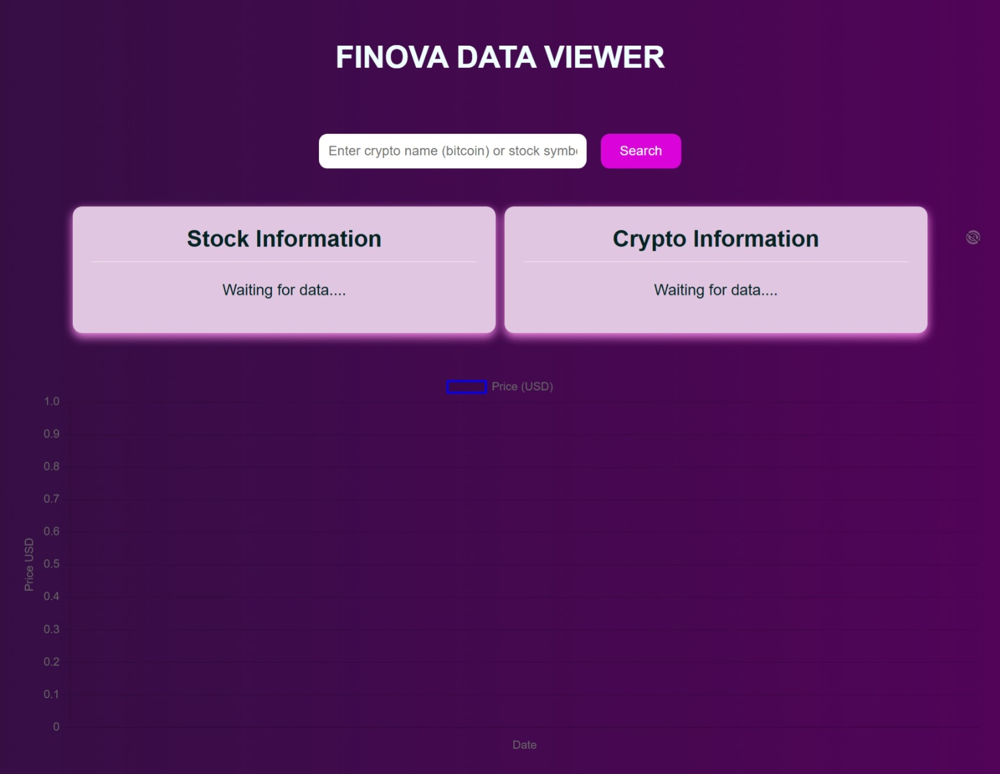
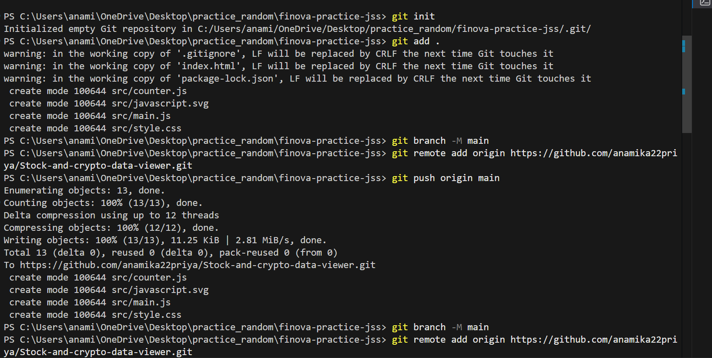
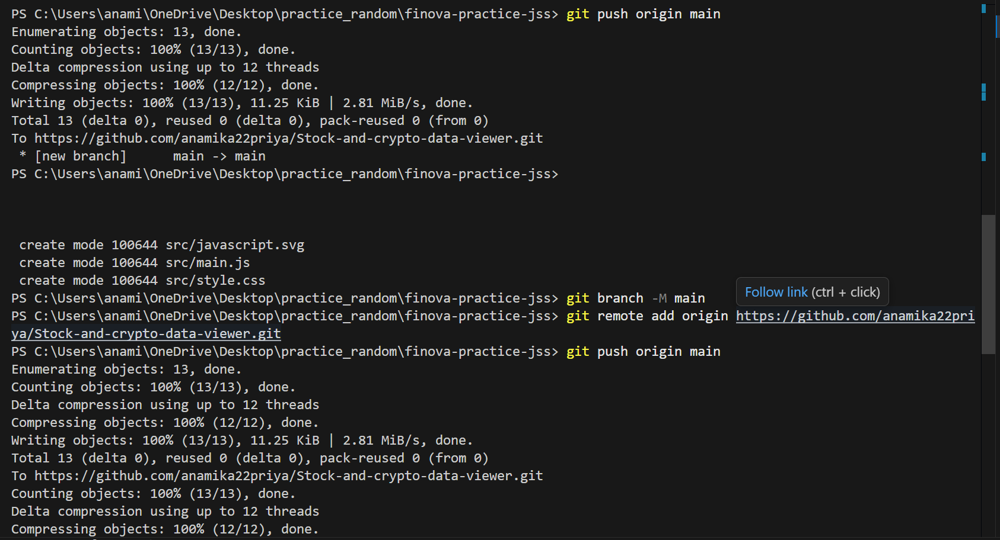
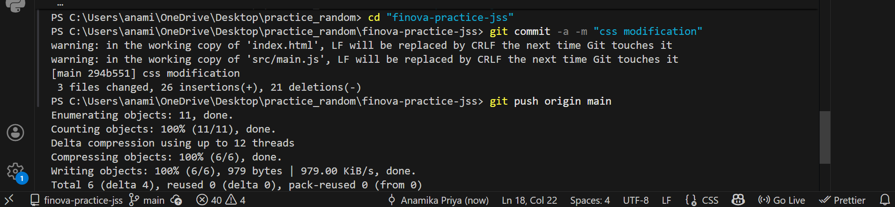

# EXPLANATION OF DOM MANIPULATION IN THIS PROJECT:
DOM (Document Object Model) manipulation refers to using JavaScript to access and modify HTML elements dynamically.
<u>How DOM works in this project?</u>
* JavaScript selects HTML elements using getElementById() or querySelector().
* When the user searches for a stock or crypto symbol, JavaScript updates the text, values, and styles of elements on the webpage.
* The page does not reload; only the required parts of the UI change.

<u>Example actions in the project:</u>
* Reading user input from the search box
* Updating price text and percentage change
* Changing colors (green/red) based on price movement
* Updating charts dynamically

# HOW DATA FLOWS IN THE PROJECT?
1. User Input: 
The user enters a stock or crypto symbol and clicks the search button. 
2. API Request: 
JavaScript captures the input value. 
A fetch()request is sent to a market data API.
3. API Response:
 The API returns market data in JSON format.
4. Processing the Data:
JavaScript extracts required values(price,change,volume)
5. UI Update(DOM Manipulation):
The extracted data is inserted into HTML elements. 
Charts and texts update dynamically without refreshing the page. 
## DIAGRAM: 
![]

# SCREENSHOTS: 
## UI: 

## CHART OUTPUT: 

## GIT COMMANDS USED: 

# REPORT ON PAYMENT GATEWAYS: 
## WHAT IS A PAYMENT GATEWAY?  
A Payment Gateway acts as a digital bridge, connecting a user’s website,or app to financial institutions to process online payments through (credit/debit cards, digital wallets, etc.), securely encrypting, transmitting, and authorizing transactions just like a physical POS terminal in a store
## WHY PAYMENT GATEWAYS ARE REQUIRED IN ONLINE APPLICATIONS?  
* To encrypt sensitive information that are transferred when a payment is processed like CVV, credit/debit card number or bank account details.
* Authorization:the gateway communicates with the bank to see if the customer has enough funds. 
* Increased security:It prevents fraud by verifying details and sometimes through using OTP’s.
* They provide an option to use multiple payment methods like:
 * credit/debit cards
 * net banking 
 * UPI wallets 
 * international cards.
* They provide real-time updates especially in P2M(Business or Merchant) transactions. 
Since the money that is transferred in P2M(Business or Merchant) is temporarily stored in a regulated nodal account, before the bank authorises the transaction, it is easier to handle refunds, cancellations and recurring payments.
* They ensure transactions meet security standards like PCI DSS. 
## REAL WORLD EXAMPLE OF PAYMENT GATEWAYS  
Razorpay- Used in Ecommerce Websites and Apps like BookMyShow - When you click on Pay to pay for the movie ticket, you will be redirected to the payment gateway where you can choose the mode of payment(UPI,credit,debit etc) and then enter the necessary information. Razorpay communicates with the bank or NCPI(Indian context).
## COMPONENTS INVOLVED IN A PAYMENT GATEWAY:  
The role of each component:
### User/Customer:
 * user initiates the payment
 * enters the payment details and selects the payment method(UPI,card,netbanking)
 * authorises the transaction using OTP.
### Frontend (Website / Application):
 * provides the user interface 
 * collects payment inputs securely 
 * sends the payment request to the backend
 * displays payment status 
### Backend (Server):
 * processes the payment gateway
 * verifies the order details and amount
 * updates database after payment confirmation
### Payment Gateway:
 * encrypts the sensitive data entered 
 * routes the transaction to the bank or NPCI/card network.
 * handles authorization, fraud checks, and OTP verification.
 * provides real-time payment status.
 * manages refunds, cancellations, and settlements.
### Bank / Card Network:
 * bank checks account balance and authenticity.
 * card networks (Visa, MasterCard, RuPay) or NPCI (UPI) process the transaction.
 * Approves or declines the payment.
 * Transfers funds to the merchant’s account.
## PAYMENT FLOW:
### Step 1:Frontend Request:
 * The user clicks “Pay Now” on a website or app.
 * The frontend collects:
   * a) payment amount
   * b) order details
   * c) chosen payment method (UPI / card / net
   banking)
 * It sends a secure payment request to the backend server.
### Step 2: Backend Processing: 
 * Backend receives the request from the frontend 
 * It validates the order and amount
 * It creates a payment order with payment gateway 
 * It generates a unique transaction/order id. 
 * The backend then sends the required details back to the frontend to continue payment. 
### Step 3: Interaction with payment gateway:
 * The frontend opens the payment gateway interface (checkout page).
 * The user enters payment details or authorizes via OTP / UPI PIN.
 * The payment gateway:
  * encrypts sensitive data
  * performs fraud checks
  * forwards the transaction to the bank / NPCI / card network
### Step 4: Bank Response:
 * Customer’s bank: 
  * checks balance 
  * verifies OTP / PIN
 * If approved:
  * money is debited from the customer’s bank
  * money is credited to the gateway’s nodal (escrow) account
  * Bank sends approval response back to the gateway. 
### Step 5: UI Update:
 * Based on the response from the Bank.
 * Payment shows successful or declines. 
### Step 6: Settlement to Merchant:
 * After a fixed settlement cycle (T+1, T+2),money is transferred from the nodal account
to the merchant’s bank account.
## PAYMENTS GATEWAY ARCHITECTURE: 
### Why the frontend alone cannot handle payments? 
 * The frontend runs on the user’s device, so its code is public and modifiable.
 * Sensitive information such as: cannot be safely stored in frontend code.
 * Frontend cannot securely communicate with banks or payment gateways on its own.
### Why a backend server is mandatory? 
 * The backend server acts as a secure, trusted layer.
 * It:
  * stores secret API keys securely
  * creates and verifies payment orders
  * communicates with the payment gateway
  * confirms payment status
  * manages refunds, cancellations, and settlements (via nodal accounts)
 * Backend ensures that payments are validated and recorded correctly before granting services or products.
### The role of APIs in payment processing: 
 * APIs enable communication between different systems.
 * In a payment flow:
  * Frontend → Backend (order request API)
  * Backend → Payment Gateway (payment creation & verification APIs)
  * Gateway → Bank / NPCI / Card Network (authorization APIs).
## DIAGRAM: 
## SECURITY CONCEPTS: 
### Why payment data must be secured? 
 * Payment data includes card numbers, CVV, bank details, and UPI credentials
 * Securing payment data ensures:
 * customer trust
 * compliance with regulations (PCI DSS)
 * protection against cyber attacks
### Why sensitive information must never be stored on the frontend? 
 * Frontend code runs on the user’s browser and is fully visible.
 * That means anyone can inspect the code and copy API keys. This entails that they can modify the API requests and misuse the information stored in the backend. 
 * This can lead to fake transactions and data leaks. 
### Risks involved in insecure payment handling? 
 * Unauthorized access to payment systems
 * Fraudulent payments and fake refunds
 * Data breaches and financial loss
 * Legal penalties and loss of customer trust
## RELATION TO THIS PROJECT: 
### How the project uses APIs? 
 * uses market data APIs to fetch real-time or near real-time information about stocks and cryptocurrencies.
 * the app sends a request (API call) to a market data provider using a stock symbol or crypto name.
 * the API responds with data such as price, change, volume, etc., usually in JSON format.
 * JavaScript processes this data and displays it dynamically on the webpage without reloading.
### How payment gateways also use APIs? 
 * When a user makes a payment, the website sends payment details to the gateway using an API.
 * The gateway communicates with banks/card networks to authorize or decline the payment.
 * The API returns a success or failure response to the website.
### Similarity between market data APIs and payment gateway APIs? 
 * They work using a request–response model.
 * Data is exchanged securely JSON.
 * The application depends on the API to perform tasks like fetch live prices or process payments.

